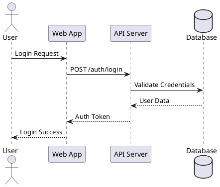
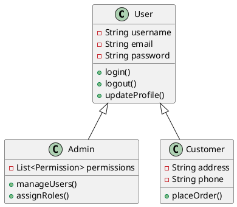
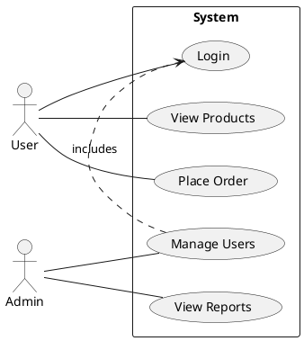
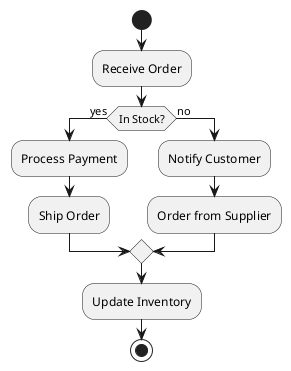

# UML MCP Service

A Model Context Protocol (MCP) service implementation for generating UML diagrams using PlantUML. This service provides a remote server that accepts UML commands from MCP clients and returns generated diagrams in various formats (PNG, SVG, TXT).

## Features

- **MCP Protocol Support**: JSON-RPC 2.0 based MCP protocol implementation
- **PlantUML Integration**: Full PlantUML support for all diagram types
- **Multiple Output Formats**: Generate diagrams in PNG, SVG, or ASCII text format
- **Remote Deployment**: Run as a standalone server on any host
- **RESTful API**: Both MCP and REST-style endpoints available
- **Docker Support**: Easy deployment using Docker/Docker Compose
- **Cross-Platform Clients**: Java and Python client implementations included

## Supported Diagram Types

- Sequence diagrams
- Class diagrams
- Use case diagrams
- Activity diagrams
- Component diagrams
- State diagrams
- Object diagrams
- Deployment diagrams
- Timing diagrams
- Network diagrams
- Wireframes
- Archimate diagrams
- Gantt charts
- Mind maps
- Work Breakdown Structure (WBS)

## Architecture

```
┌─────────────────┐
│  MCP Clients    │
│  (Java/Python)  │
└────────┬────────┘
         │ HTTP/JSON-RPC
         │
┌────────▼────────┐
│   MCP Server    │
│   (Javalin)     │
├─────────────────┤
│  PlantUML       │
│  Service        │
└─────────────────┘
```

## Quick Start

### Using Docker Compose (Recommended)

```bash
# Clone the repository
git clone <repository-url>
cd uml-mcp

# Build and start the server
cd server
docker-compose up -d

# Check server status
curl http://localhost:8080/health
```

### Manual Build and Run

```bash
# Build the server
cd server
mvn clean package

# Run the server
java -jar target/uml-mcp-server-1.0.0.jar

# Or with custom host/port
java -jar target/uml-mcp-server-1.0.0.jar --host 0.0.0.0 --port 9000
```

## Server Usage

### Starting the Server

```bash
# Default configuration (0.0.0.0:8080)
java -jar uml-mcp-server-1.0.0.jar

# Custom host and port
java -jar uml-mcp-server-1.0.0.jar --host localhost --port 9000

# Using Docker
docker run -p 8080:8080 uml-mcp-server
```

### Available Endpoints

#### MCP Endpoints

- `POST /mcp/generate` - Generate UML diagram
- `POST /mcp/validate` - Validate UML source
- `POST /mcp/capabilities` - Get server capabilities

#### REST Endpoints

- `POST /api/v1/diagrams/generate` - Generate UML diagram
- `POST /api/v1/diagrams/validate` - Validate UML source
- `GET /api/v1/capabilities` - Get server capabilities
- `GET /health` - Health check

## Client Usage

### Java Client

#### Build

```bash
cd clients/java
mvn clean package
```

#### Usage

```bash
# Generate diagram with default example
java -jar target/uml-mcp-java-client-1.0.0.jar generate http://localhost:8080

# Generate from custom UML source
java -jar target/uml-mcp-java-client-1.0.0.jar generate \
  http://localhost:8080 \
  "@startuml\nAlice -> Bob: Hello\n@enduml" \
  png \
  output.png

# Validate UML
java -jar target/uml-mcp-java-client-1.0.0.jar validate \
  http://localhost:8080 \
  "@startuml\nAlice -> Bob\n@enduml"

# Get capabilities
java -jar target/uml-mcp-java-client-1.0.0.jar capabilities http://localhost:8080
```

#### As a Library

```java
import com.mcp.client.UMLMCPClient;

UMLMCPClient client = new UMLMCPClient("http://localhost:8080");

String uml = "@startuml\nAlice -> Bob: Hello\n@enduml";
MCPResponse response = client.generateDiagram(uml, "png", "sequence");

if (response.getError() == null) {
    client.saveDiagram(response, "output.png");
}
```

### Python Client

#### Installation

```bash
cd clients/python
pip install -r requirements.txt
```

#### Usage

```bash
# Generate diagram with default example
python uml_mcp_client.py generate --server http://localhost:8080

# Generate from file
python uml_mcp_client.py generate \
  --server http://localhost:8080 \
  --uml diagram.puml \
  --format png \
  --output result.png

# Generate from inline UML
python uml_mcp_client.py generate \
  --uml "@startuml\nAlice -> Bob\n@enduml" \
  --format svg

# Use built-in examples
python uml_mcp_client.py generate --example sequence --format png
python uml_mcp_client.py generate --example class --format svg

# Validate UML
python uml_mcp_client.py validate --uml diagram.puml

# Get capabilities
python uml_mcp_client.py capabilities
```

#### As a Library

```python
from uml_mcp_client import UMLMCPClient

client = UMLMCPClient("http://localhost:8080")

uml_source = """
@startuml
Alice -> Bob: Hello
Bob --> Alice: Hi!
@enduml
"""

response = client.generate_diagram(uml_source, "png", "sequence")

if not response.has_error():
    client.save_diagram(response, "output.png")
```

## Sample Requests

### Generate Sequence Diagram

**Request:**
```bash
curl -X POST http://localhost:8080/mcp/generate \
  -H "Content-Type: application/json" \
  -d '{
    "jsonrpc": "2.0",
    "id": "1",
    "method": "generate",
    "params": {
      "uml": "@startuml\nAlice -> Bob: Authentication Request\nBob --> Alice: Authentication Response\n@enduml",
      "format": "png",
      "diagramType": "sequence"
    }
  }'
```

**Response:**
```json
{
  "jsonrpc": "2.0",
  "id": "1",
  "result": {
    "diagram": "iVBORw0KGgoAAAANSUhEUgAA...(base64 encoded PNG)",
    "format": "png",
    "diagramType": "sequence",
    "timestamp": 1698765432000
  }
}
```

### Generate Class Diagram (SVG)

**Request:**
```bash
curl -X POST http://localhost:8080/mcp/generate \
  -H "Content-Type: application/json" \
  -d '{
    "jsonrpc": "2.0",
    "id": "2",
    "method": "generate",
    "params": {
      "uml": "@startuml\nclass User {\n  -username: String\n  +login()\n}\n@enduml",
      "format": "svg",
      "diagramType": "class"
    }
  }'
```

### Generate Activity Diagram (ASCII Text)

**Request:**
```bash
curl -X POST http://localhost:8080/mcp/generate \
  -H "Content-Type: application/json" \
  -d '{
    "jsonrpc": "2.0",
    "id": "3",
    "method": "generate",
    "params": {
      "uml": "@startuml\n:Start;\n:Process Data;\n:End;\n@enduml",
      "format": "txt",
      "diagramType": "activity"
    }
  }'
```

**Response:**
```json
{
  "jsonrpc": "2.0",
  "id": "3",
  "result": {
    "diagramText": "     ┌─────┐\n     │Start│\n     └──┬──┘\n...",
    "format": "txt",
    "diagramType": "activity",
    "timestamp": 1698765432100
  }
}
```

### Validate UML

**Request:**
```bash
curl -X POST http://localhost:8080/mcp/validate \
  -H "Content-Type: application/json" \
  -d '{
    "jsonrpc": "2.0",
    "id": "4",
    "method": "validate",
    "params": {
      "uml": "@startuml\nAlice -> Bob\n@enduml"
    }
  }'
```

**Response:**
```json
{
  "jsonrpc": "2.0",
  "id": "4",
  "result": {
    "diagramText": "Valid UML",
    "timestamp": 1698765432200
  }
}
```

### Get Capabilities

**Request:**
```bash
curl -X POST http://localhost:8080/mcp/capabilities \
  -H "Content-Type: application/json" \
  -d '{
    "jsonrpc": "2.0",
    "id": "5",
    "method": "capabilities"
  }'
```

**Response:**
```json
{
  "jsonrpc": "2.0",
  "id": "5",
  "result": {
    "diagramText": "Supported Diagram Types: sequence, usecase, class, activity, component, state, object, deployment, timing, network, wireframe, archimate, gantt, mindmap, wbs\nSupported Formats: png, svg, txt",
    "timestamp": 1698765432300
  }
}
```

## UML Examples

### Sequence Diagram



### Class Diagram



### Use Case Diagram



### Activity Diagram



## Error Handling

The server returns standard JSON-RPC 2.0 error responses:

**Error Response:**
```json
{
  "jsonrpc": "2.0",
  "id": "1",
  "error": {
    "code": -32602,
    "message": "Invalid params: 'uml' parameter is required",
    "data": "Additional error details"
  }
}
```

**Error Codes:**
- `-32700`: Parse error
- `-32600`: Invalid Request
- `-32602`: Invalid params
- `-32000`: Server error

## Performance Considerations

- Diagram generation time varies based on complexity (typically 100-500ms)
- Server can handle concurrent requests
- For high-traffic scenarios, consider:
  - Implementing caching for frequently generated diagrams
  - Load balancing multiple server instances
  - Adding request rate limiting

## Deployment

### Docker Deployment

```bash
# Build the image
cd server
docker build -t uml-mcp-server .

# Run the container
docker run -d -p 8080:8080 --name uml-mcp uml-mcp-server

# Check logs
docker logs -f uml-mcp
```

### Production Deployment Checklist

- [ ] Configure appropriate host and port
- [ ] Set up reverse proxy (nginx/Apache) for HTTPS
- [ ] Implement request rate limiting
- [ ] Configure logging and monitoring
- [ ] Set up health checks and alerts
- [ ] Consider implementing authentication/authorization
- [ ] Enable CORS only for trusted domains

## Development

### Building from Source

```bash
# Server
cd server
mvn clean install

# Java Client
cd clients/java
mvn clean install

# Python Client (development mode)
cd clients/python
pip install -e .
```

### Running Tests

```bash
# Server tests
cd server
mvn test

# Manual testing
./test-server.sh
```

## Troubleshooting

### Server won't start

- Check if port 8080 is already in use: `netstat -an | grep 8080`
- Try a different port: `java -jar server.jar --port 9000`

### Diagram generation fails

- Ensure PlantUML dependencies are properly installed
- Check server logs for detailed error messages
- Verify UML syntax using the validate endpoint

### Client connection issues

- Verify server is running: `curl http://localhost:8080/health`
- Check firewall settings
- Ensure correct server URL in client configuration

## API Documentation

See [docs/API.md](docs/API.md) for detailed API documentation.

## License

MIT License - See LICENSE file for details

## Contributing

Contributions are welcome! Please feel free to submit a Pull Request.

## Support

For issues and questions:
- Open an issue on GitHub
- Check existing documentation in the `docs/` directory

## Acknowledgments

- [PlantUML](https://plantuml.com/) - UML diagram generation engine
- [Javalin](https://javalin.io/) - Lightweight web framework for Java
