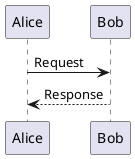

# UML MCP Server - API Documentation

## Overview

The UML MCP Server provides a JSON-RPC 2.0 based API for generating UML diagrams using PlantUML. The service supports both MCP-style endpoints and RESTful endpoints for convenience.

## Base URL

```
http://<host>:<port>
```

Default: `http://localhost:8080`

## Protocol

All requests and responses follow the JSON-RPC 2.0 specification:
- Request/Response must include `jsonrpc: "2.0"`
- Each request must have a unique `id`
- Successful responses include a `result` field
- Error responses include an `error` field

## Endpoints

### 1. Generate Diagram

Generate a UML diagram from PlantUML source code.

**Endpoint:** `POST /mcp/generate`

**Request:**

```json
{
  "jsonrpc": "2.0",
  "id": "unique-request-id",
  "method": "generate",
  "params": {
    "uml": "PlantUML source code",
    "format": "png | svg | txt",
    "diagramType": "sequence | class | usecase | activity | ..."
  }
}
```

**Request Parameters:**

| Parameter | Type | Required | Default | Description |
|-----------|------|----------|---------|-------------|
| `uml` | string | Yes | - | PlantUML source code. Can include or omit @startuml/@enduml tags |
| `format` | string | No | "png" | Output format: "png", "svg", or "txt" |
| `diagramType` | string | No | "sequence" | Type of diagram being generated |

**Success Response:**

```json
{
  "jsonrpc": "2.0",
  "id": "unique-request-id",
  "result": {
    "diagram": "base64-encoded-binary-data",
    "diagramText": "ascii-text-for-txt-format",
    "format": "png",
    "diagramType": "sequence",
    "timestamp": 1698765432000
  }
}
```

**Response Fields:**

| Field | Type | Description |
|-------|------|-------------|
| `diagram` | string | Base64-encoded diagram (for PNG/SVG formats) |
| `diagramText` | string | Plain text diagram (for TXT format) |
| `format` | string | The format of the generated diagram |
| `diagramType` | string | The type of diagram |
| `timestamp` | number | Unix timestamp in milliseconds |

**Note:** Either `diagram` or `diagramText` will be populated, depending on the format.

**Example - PNG Format:**

```bash
curl -X POST http://localhost:8080/mcp/generate \
  -H "Content-Type: application/json" \
  -d '{
    "jsonrpc": "2.0",
    "id": "req-001",
    "method": "generate",
    "params": {
      "uml": "@startuml\nAlice -> Bob: Hello\nBob --> Alice: Hi!\n@enduml",
      "format": "png",
      "diagramType": "sequence"
    }
  }'
```

**Example - SVG Format:**

```bash
curl -X POST http://localhost:8080/mcp/generate \
  -H "Content-Type: application/json" \
  -d '{
    "jsonrpc": "2.0",
    "id": "req-002",
    "method": "generate",
    "params": {
      "uml": "class User {\n  +login()\n}",
      "format": "svg",
      "diagramType": "class"
    }
  }'
```

**Example - Text Format:**

```bash
curl -X POST http://localhost:8080/mcp/generate \
  -H "Content-Type: application/json" \
  -d '{
    "jsonrpc": "2.0",
    "id": "req-003",
    "method": "generate",
    "params": {
      "uml": "@startuml\n:Start;\n:End;\n@enduml",
      "format": "txt",
      "diagramType": "activity"
    }
  }'
```

### 2. Validate UML

Validate PlantUML source code without generating a diagram.

**Endpoint:** `POST /mcp/validate`

**Request:**

```json
{
  "jsonrpc": "2.0",
  "id": "unique-request-id",
  "method": "validate",
  "params": {
    "uml": "PlantUML source code"
  }
}
```

**Request Parameters:**

| Parameter | Type | Required | Description |
|-----------|------|----------|-------------|
| `uml` | string | Yes | PlantUML source code to validate |

**Success Response:**

```json
{
  "jsonrpc": "2.0",
  "id": "unique-request-id",
  "result": {
    "diagramText": "Valid UML",
    "timestamp": 1698765432000
  }
}
```

**Example:**

```bash
curl -X POST http://localhost:8080/mcp/validate \
  -H "Content-Type: application/json" \
  -d '{
    "jsonrpc": "2.0",
    "id": "val-001",
    "method": "validate",
    "params": {
      "uml": "@startuml\nAlice -> Bob\n@enduml"
    }
  }'
```

### 3. Get Capabilities

Retrieve server capabilities, including supported diagram types and formats.

**Endpoint:** `POST /mcp/capabilities`

**Request:**

```json
{
  "jsonrpc": "2.0",
  "id": "unique-request-id",
  "method": "capabilities",
  "params": {}
}
```

**Success Response:**

```json
{
  "jsonrpc": "2.0",
  "id": "unique-request-id",
  "result": {
    "diagramText": "Supported Diagram Types: sequence, usecase, class, activity, component, state, object, deployment, timing, network, wireframe, archimate, gantt, mindmap, wbs\nSupported Formats: png, svg, txt",
    "timestamp": 1698765432000
  }
}
```

**Example:**

```bash
curl -X POST http://localhost:8080/mcp/capabilities \
  -H "Content-Type: application/json" \
  -d '{
    "jsonrpc": "2.0",
    "id": "cap-001",
    "method": "capabilities"
  }'
```

### 4. Health Check

Check if the server is running.

**Endpoint:** `GET /health`

**Response:** `200 OK` with body "OK"

**Example:**

```bash
curl http://localhost:8080/health
```

## Error Responses

All errors follow the JSON-RPC 2.0 error response format:

```json
{
  "jsonrpc": "2.0",
  "id": "request-id",
  "error": {
    "code": -32602,
    "message": "Error description",
    "data": "Additional error details (optional)"
  }
}
```

### Error Codes

| Code | Message | Description |
|------|---------|-------------|
| `-32700` | Parse error | Invalid JSON was received |
| `-32600` | Invalid Request | The JSON sent is not a valid Request object |
| `-32602` | Invalid params | Invalid method parameter(s) |
| `-32000` | Server error | Internal server error during diagram generation |

### Error Examples

**Missing Required Parameter:**

```json
{
  "jsonrpc": "2.0",
  "id": "req-001",
  "error": {
    "code": -32602,
    "message": "Invalid params: 'uml' parameter is required"
  }
}
```

**Invalid UML Syntax:**

```json
{
  "jsonrpc": "2.0",
  "id": "req-002",
  "error": {
    "code": -32000,
    "message": "Server error: Failed to generate diagram: Syntax error in PlantUML",
    "data": "net.sourceforge.plantuml.SyntaxException: ..."
  }
}
```

## REST-Style Endpoints (Alternative)

For clients that prefer REST-style endpoints, the following are also available:

### Generate Diagram (REST)

**Endpoint:** `POST /api/v1/diagrams/generate`

Same request/response format as `/mcp/generate`

### Validate UML (REST)

**Endpoint:** `POST /api/v1/diagrams/validate`

Same request/response format as `/mcp/validate`

### Get Capabilities (REST)

**Endpoint:** `GET /api/v1/capabilities`

Returns capabilities without requiring a POST body.

## Supported Diagram Types

The following PlantUML diagram types are supported:

| Type | Description |
|------|-------------|
| `sequence` | Sequence diagrams |
| `usecase` | Use case diagrams |
| `class` | Class diagrams |
| `activity` | Activity diagrams |
| `component` | Component diagrams |
| `state` | State diagrams |
| `object` | Object diagrams |
| `deployment` | Deployment diagrams |
| `timing` | Timing diagrams |
| `network` | Network diagrams |
| `wireframe` | Wireframe diagrams |
| `archimate` | Archimate diagrams |
| `gantt` | Gantt charts |
| `mindmap` | Mind maps |
| `wbs` | Work Breakdown Structure |

## PlantUML Syntax

The server accepts standard PlantUML syntax. The `@startuml` and `@enduml` tags are optional - the server will add them if not present.

### Examples

**With Tags:**


**Without Tags (automatically wrapped):**
```plantuml
Alice -> Bob: Request
Bob --> Alice: Response
```

Both formats are valid and will produce the same result.

## Output Formats

### PNG (Binary)

- Returns Base64-encoded PNG image in the `diagram` field
- Best for embedding in web pages or saving as image files
- Decode the Base64 string to get the binary PNG data

**Decoding Base64 (Example):**

```bash
# Using jq and base64
curl -s http://localhost:8080/mcp/generate ... | \
  jq -r '.result.diagram' | \
  base64 -d > output.png
```

```python
# Python
import base64
diagram_data = base64.b64decode(response['result']['diagram'])
with open('output.png', 'wb') as f:
    f.write(diagram_data)
```

### SVG (Binary)

- Returns Base64-encoded SVG in the `diagram` field
- Scalable vector format
- Can be decoded to text XML

### TXT (Text)

- Returns ASCII art representation in the `diagramText` field
- Useful for console output or text-based documentation
- Not all diagram types render well in text format

## Rate Limiting

Currently, the server does not implement rate limiting. For production deployments, consider:

- Implementing rate limiting at the reverse proxy level (nginx, Apache)
- Adding application-level rate limiting
- Monitoring request patterns and blocking abuse

## Authentication

The default server does not require authentication. For production deployments, consider:

- Adding API key authentication
- Implementing OAuth 2.0
- Using JWT tokens
- Restricting access via firewall rules

## CORS

The server has CORS enabled for all origins by default. For production:

- Configure CORS to allow only trusted domains
- Modify the server configuration to specify allowed origins

## Performance

### Response Times

Typical response times (depending on diagram complexity):

- Simple diagrams: 100-300ms
- Medium complexity: 300-500ms
- Complex diagrams: 500-1000ms

### Optimization Tips

1. **Caching**: Implement caching for frequently generated diagrams
2. **Async Processing**: For batch operations, consider async job queues
3. **Resource Limits**: Monitor memory usage for complex diagrams
4. **Connection Pooling**: Use HTTP keep-alive for multiple requests

## Best Practices

### Client Implementation

1. **Always include a unique request ID** for tracking
2. **Implement timeout handling** (recommended: 30 seconds)
3. **Handle errors gracefully** with proper error messages
4. **Validate UML before generating** for better user experience
5. **Cache generated diagrams** to reduce server load

### Server Configuration

1. **Use reverse proxy** (nginx/Apache) for HTTPS
2. **Configure appropriate timeouts** for complex diagrams
3. **Monitor server resources** (CPU, memory)
4. **Implement logging** for debugging and analytics
5. **Set up health checks** for monitoring

## Troubleshooting

### Common Issues

**Issue:** "Invalid params: 'uml' parameter is required"
- **Solution:** Ensure the `params.uml` field is present and not empty

**Issue:** "Server error: Failed to generate diagram"
- **Solution:** Check PlantUML syntax, enable detailed logging

**Issue:** Request timeout
- **Solution:** Simplify the diagram, increase client timeout

**Issue:** "Parse error"
- **Solution:** Verify JSON syntax, ensure proper Content-Type header

## Examples by Diagram Type

### Sequence Diagram

```json
{
  "uml": "@startuml\nActor User\nUser -> System: Request\nSystem --> User: Response\n@enduml",
  "format": "png",
  "diagramType": "sequence"
}
```

### Class Diagram

```json
{
  "uml": "@startuml\nclass User {\n  -username: String\n  +login()\n}\n@enduml",
  "format": "svg",
  "diagramType": "class"
}
```

### Use Case Diagram

```json
{
  "uml": "@startuml\nactor User\nUser -- (Login)\nUser -- (Browse)\n@enduml",
  "format": "png",
  "diagramType": "usecase"
}
```

### Activity Diagram

```json
{
  "uml": "@startuml\nstart\n:Process;\nstop\n@enduml",
  "format": "txt",
  "diagramType": "activity"
}
```

## Version Information

- API Version: 1.0.0
- PlantUML Version: Check via server startup logs
- Protocol: JSON-RPC 2.0

## Support

For additional help:
- Check the main [README.md](../README.md)
- Review PlantUML documentation: https://plantuml.com/
- Open an issue on GitHub
