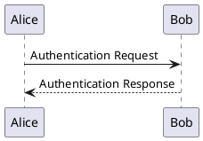
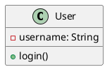
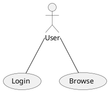
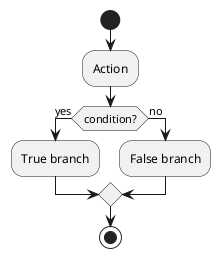

# Quick Start Guide

Get started with UML MCP Service in 5 minutes!

## Prerequisites

- Java 17 or higher
- Maven 3.6+ (for building from source)
- Docker (optional, for containerized deployment)
- Python 3.7+ (optional, for Python client)

## Option 1: Docker (Fastest)

### 1. Start the Server

```bash
cd server
docker-compose up -d
```

### 2. Verify Server is Running

```bash
curl http://localhost:8080/health
# Expected output: OK
```

### 3. Generate Your First Diagram

```bash
curl -X POST http://localhost:8080/mcp/generate \
  -H "Content-Type: application/json" \
  -d '{
    "jsonrpc": "2.0",
    "id": "1",
    "method": "generate",
    "params": {
      "uml": "@startuml\nAlice -> Bob: Hello\n@enduml",
      "format": "png"
    }
  }' | jq -r '.result.diagram' | base64 -d > diagram.png
```

Done! Open `diagram.png` to see your UML diagram.

## Option 2: Build from Source

### 1. Build the Server

```bash
cd server
mvn clean package
```

### 2. Start the Server

```bash
java -jar target/uml-mcp-server-1.0.0.jar
```

### 3. Test with Python Client

```bash
cd clients/python
pip install -r requirements.txt

# Generate a diagram using built-in example
python uml_mcp_client.py generate --example sequence
```

### 4. Test with Java Client

```bash
cd clients/java
mvn clean package

# Generate a diagram
java -jar target/uml-mcp-java-client-1.0.0.jar generate
```

## Common Use Cases

### Generate PNG Sequence Diagram

```bash
python clients/python/uml_mcp_client.py generate \
  --uml "Alice -> Bob: Request\nBob --> Alice: Response" \
  --format png \
  --output sequence.png
```

### Generate SVG Class Diagram

```bash
python clients/python/uml_mcp_client.py generate \
  --uml "class User {\n  +login()\n}" \
  --format svg \
  --output class.svg
```

### Generate from File

```bash
# Create a PlantUML file
cat > mydiagram.puml << EOF
@startuml
actor User
User -> System: Request
System --> User: Response
@enduml
EOF

# Generate diagram
python clients/python/uml_mcp_client.py generate \
  --uml mydiagram.puml \
  --format png \
  --output mydiagram.png
```

### Validate UML Syntax

```bash
python clients/python/uml_mcp_client.py validate \
  --uml "@startuml\nAlice -> Bob\n@enduml"
```

## Using the Example Scripts

We provide ready-to-use example scripts:

### Run All Examples

```bash
./scripts/run-example.sh http://localhost:8080 ./output
```

This generates multiple example diagrams in the `./output` directory.

### Test the Server

```bash
./scripts/test-server.sh http://localhost:8080
```

This runs a comprehensive test suite against the server.

## Understanding the Response

### PNG/SVG Response (Base64 encoded)

```json
{
  "jsonrpc": "2.0",
  "id": "1",
  "result": {
    "diagram": "iVBORw0KGgo...(base64 encoded image)",
    "format": "png",
    "diagramType": "sequence",
    "timestamp": 1698765432000
  }
}
```

To decode and save:

```bash
# Using jq and base64
curl ... | jq -r '.result.diagram' | base64 -d > output.png
```

```python
# Python
import base64
diagram_bytes = base64.b64decode(response['result']['diagram'])
with open('output.png', 'wb') as f:
    f.write(diagram_bytes)
```

### Text Response (ASCII art)

```json
{
  "jsonrpc": "2.0",
  "id": "1",
  "result": {
    "diagramText": "     ┌─────┐\n     │Start│\n     └──┬──┘\n...",
    "format": "txt",
    "diagramType": "activity",
    "timestamp": 1698765432000
  }
}
```

## PlantUML Syntax Basics

### Sequence Diagram



### Class Diagram



### Use Case Diagram



### Activity Diagram



## Next Steps

1. **Explore Examples**: Check the `examples/` directory for more complex diagrams
2. **Read API Docs**: See [docs/API.md](API.md) for complete API reference
3. **Try Different Formats**: Experiment with PNG, SVG, and TXT formats
4. **Integrate**: Use the Java or Python client libraries in your projects
5. **Deploy**: Use Docker Compose for production deployment

## Troubleshooting

### Server won't start

```bash
# Check if port 8080 is in use
lsof -i :8080

# Use a different port
java -jar server.jar --port 9000
```

### Can't generate diagrams

```bash
# Test server health
curl http://localhost:8080/health

# Check server capabilities
curl -X POST http://localhost:8080/mcp/capabilities \
  -H "Content-Type: application/json" \
  -d '{"jsonrpc":"2.0","id":"1","method":"capabilities"}'
```

### Client connection failed

```bash
# Verify server URL
ping localhost

# Test with curl
curl http://localhost:8080/health
```

## Getting Help

- **Documentation**: See [README.md](../README.md) for detailed information
- **API Reference**: See [docs/API.md](API.md)
- **Examples**: Check `examples/` directory
- **Issues**: Report bugs on GitHub

## Resources

- [PlantUML Official Documentation](https://plantuml.com/)
- [JSON-RPC 2.0 Specification](https://www.jsonrpc.org/specification)
- [PlantUML Language Reference](https://plantuml.com/guide)
